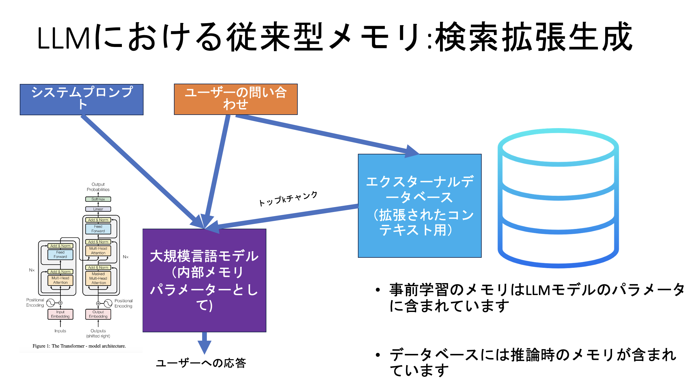
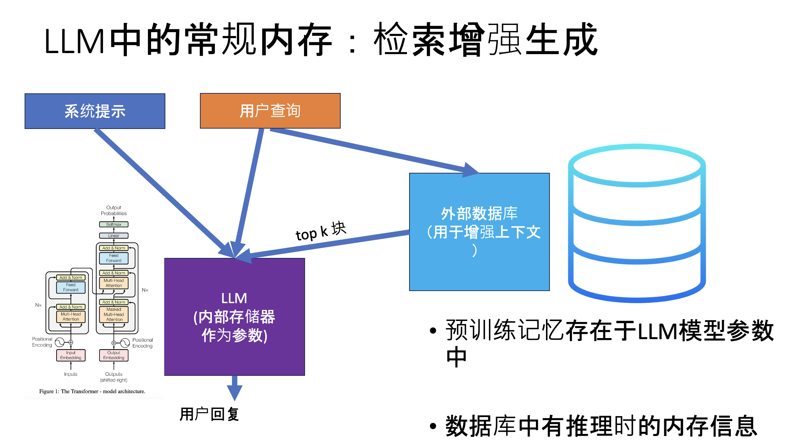

# Translator Notebook

This repository provides an interactive Jupyter Notebook (`Translator.ipynb`) that automates the translation of PowerPoint slides into multiple languages using OpenAI's API and preserves text formatting and speaker notes. It demonstrates how to:

* Load and parse a PowerPoint (`.pptx`) file
* Extract and sort text frames and table cells
* Translate each text run via OpenAI
* Rebuild slides with original styling
* Generate speaker notes with both translated and original text

## Screenshots

Below are example slides before and after translation:

|            Original Slide | French Translation    |
| ------------------------: | :-------------------- |
|  |  |

|      Japanese Translation | Chinese Translation     |
| ------------------------: | :---------------------- |
|  |  |


## Prerequisites

Before you begin, ensure you have the following installed:

* Python 3.8 or later
* `pip` for package management
* A valid OpenAI API key

## Installation

1. Clone this repository:

   ```bash
   git clone https://your-repo-url.git
   cd your-repo-folder
   ```

2. Create and activate a virtual environment (optional but recommended):

   ```bash
   python -m venv venv
   source venv/bin/activate  # macOS/Linux
   venv\\Scripts\\activate   # Windows
   ```

3. Install required packages:

   ```bash
   pip install python-pptx python-dotenv openai agentjo
   ```

4. Place your PowerPoint file in this directory, named `MemOS.pptx` (or adjust the `POWERPOINT_NAME` variable in the notebook).

5. Copy your OpenAI key into a `.env` file alongside the notebook:

   ```text
   OPENAI_API_KEY=your_api_key_here
   ```

## Usage

1. Open `Translator.ipynb` in Jupyter:

   ```bash
   jupyter notebook Translator.ipynb
   ```

2. Review and modify (if needed) the global constants at the top of the notebook:

   ```python
   POWERPOINT_NAME = "MemOS"         # Your PPTX filename (without extension)
   LANGUAGE = "French"              # Target translation language
   ```

3. Run all cells. The script will:

   * Read `MemOS.pptx`
   * Translate each slide into the specified language
   * Save a new file `MemOS_<Language>.pptx`
   * Populate speaker notes with `[translated text] [original text]`

4. Check the output in the same folder. For example:

   ```
   MemOS_French.pptx
   MemOS_Japanese.pptx
   MemOS_Chinese.pptx
   ```
   
## Troubleshooting

* **Cannot open translated PPTX**: Ensure no PowerPoint window has the file open during processing.
* **Missing API key errors**: Verify `.env` contains `OPENAI_API_KEY` and that `python-dotenv` is loading it correctly.
* **Formatting issues**: Check your versions of `python-pptx` and adjust text-fit settings if needed. You may also need to manually adjust some text boxes or table cells just to make it fit better.

## Contributing

Feel free to submit issues or pull requests to improve the translation logic, add more languages, or support additional file formats.

---

*This README was generated to guide users through running the Translator notebook and understanding its output.*
