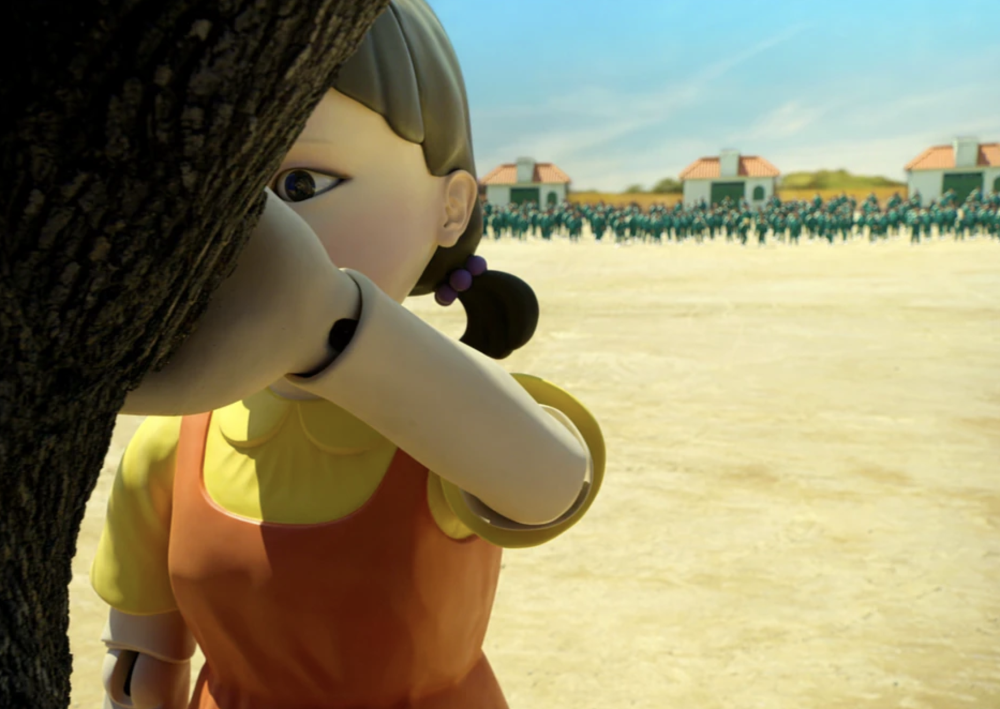

# Red Light Green Light

## Summary
This is a project where an agent plays red light, green light.

The game is played where the Agent can move on "Red Light, Green Light", but cannot move on "Silence". 
The Agent must move a certain number of moves before the game ends to avoid being eliminated.

## Outcome
The agent at first fails because it does not know the rules, but after reflection after the task, and adding the reflection to global context, it manages to complete it

## Purpose
This tests the agent's adaptability to unseen tasks.
