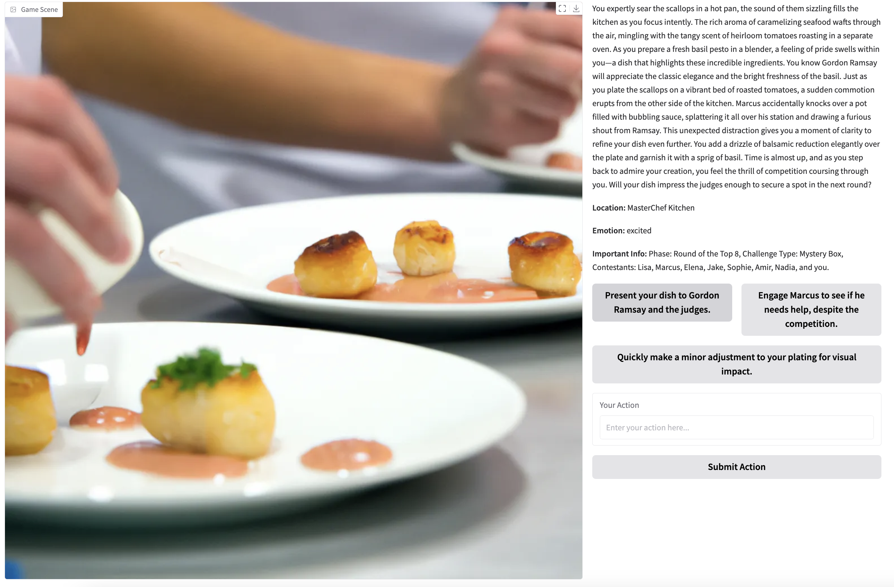
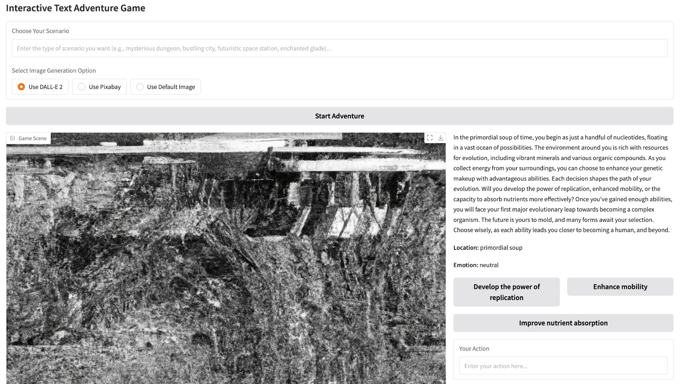

# Interactive Text Game
Customise your adventure with scenarios that cater to your interests!
Example: 

## Three Body Problem:
Scenario Prompt:
```
You are now one of the Wall Facers in the Three-body problem.
Come up with a plan to defend Earth against the aliens without them knowing.
The options should be strategic and with significant technology imbued into them.
```


## MasterChef
Scenario Prompt:
```
MasterChef Game - You are a chef competing in MasterChef and you seek to impress Gordon Ramsay, one of the judges, so that you may win first place.
Start with the top 8, and after each challenge, eliminate one player (can be yourself too) until the final two showdown.
If you are eliminated, or game is won, offer the option to restart.
In important info, state the phase of the challenge ("Round of the Top X"), the type of challenge (Mystery Box, Invention Test, Team Challenge, Pressure Test, or even a Restaurant Takeover,  etc.), and names of contestants remaining (write out all the names).
Update the location of the challenge accordingly - it can be the MasterChef Kitchen, a fine-dining restaurant, or an outdoor venue like a beach, vineyard, or luxury hotel banquet.
Make the challenges exciting, filled with unexpected twists.
Sometimes what you do can go wrong, you have to recover from these setbacks gracefully, or even change your dish idea.
Make the description more food-based, and make the options more strategic involving food preparation and choices.
Make the judge decision process faster.
```


## Evolution Game
Scenario Prompt:
```
Evolution Game - The game only has two types of options: Choose Ability or Evolve
Player can either choose new abilities for the current organism, or evolve into a new one.
This is meant to be a documentary-style exploration - use realistic organism names and abilities.
Make the exploration full of wonder and possibilities.
The player starts as pieces of nucleotides, and evolves to a human, and then superhuman and beyond. 
Make the emotion neutral, calm or scared only.
Make the location reflect where the organism can live.
Make the important information store the name of the organism and the abilities.
```


# Interactive Text Game
- v3: 26 Feb 2025

- Added Important Info to store important information across time

- v2: 25 Feb 2025

- Added the user-defined scenario inside each prompt to get the generation to adhere to the template better

- Created: 24 Feb 2025

- You can come up with your own scenario, and the game will give you 3 options to choose to advance the story
- If you do not like the options, you can also come up with your own options

- Game keeps track of your location and your emotion for each game state

- Text and image will be generated at each step

- If you do not want the image generation, then choose "Use Default Image"

- Preparation: In your .env file, add in the OPENAI_API_KEY, or the API keys of the LLM you are using

- There is also an Images and Music folder