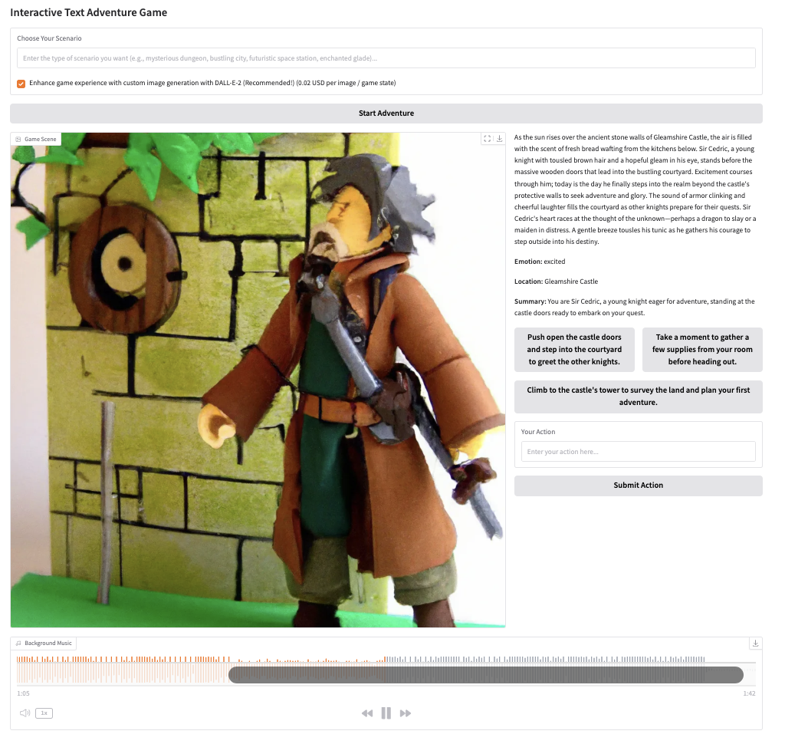

# Interactive Text Game

- Created: 24 Feb 2025

- You can come up with your own scenario, and the game will give you 3 options to choose to advance the story
- If you do not like the options, you can also come up with your own options

- Game keeps track of your location and your emotion for each game state

- Text and image will be generated at each step

- If you do not want the image generation, then untick the image gen checkbox

- Preparation: In your .env file, add in the OPENAI_API_KEY, or the API keys of the LLM you are using

- If you would like to use Pixabay image search instead of generation, add in the PIXABAY_API_KEY in .env. You can get an API key here: <a href = "https://www.pixabay.com/"> https://pixabay.com/ </a>

- There is also an Images and Music folder

- To run: Open the Game.ipynb and run the cell. Enjoy!
