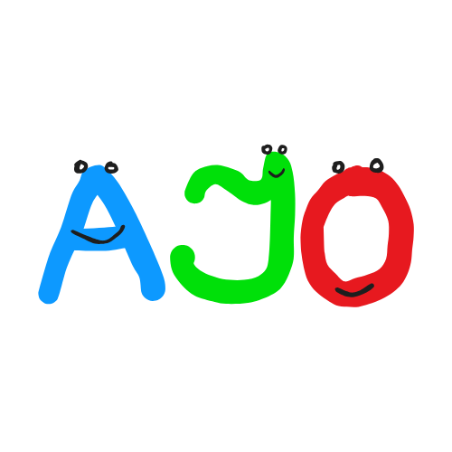
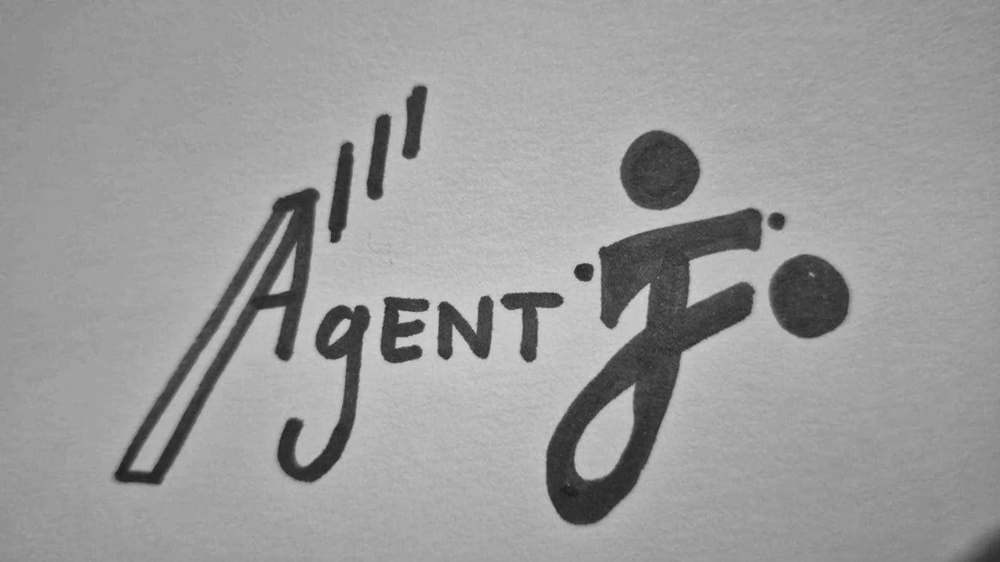

<!DOCTYPE html>
<html>
<head>
  <meta charset="UTF-8">
  <title>AgentJo Logo Design Competition</title>
</head>
<body>

<h1>AgentJo Logo Design Competition</h1>

  AgentJo is John's project for the next 5 – 10 years to create fast learning and adaptable agents!

  To reflect this ideology, we had a logo design competition, which ended on 11 Mar 2025, 2359hrs (GMT+8). 
  <strong>Winner: Boddhu Sri Pavan</strong>

<table style="border-collapse: collapse; margin: auto;">
  <tr>
    <td style="text-align: center; padding: 10px;">
      
    </td>
    <td style="text-align: center; padding: 10px;">
      
    </td>
    <td style="text-align: center; padding: 10px;">
      
    </td>
  </tr>
  <tr>
    <td style="background-color: yellow; text-align: center; padding: 10px;">
      <strong>Boddhu Sri Pavan</strong> (winner)
    </td>
    <td style="text-align: center; padding: 10px;">
      <strong>Randy</strong>
    </td>
    <td style="text-align: center; padding: 10px;">
      <strong>neoneye</strong>
    </td>
  </tr>
</table>

</body>
</html>
